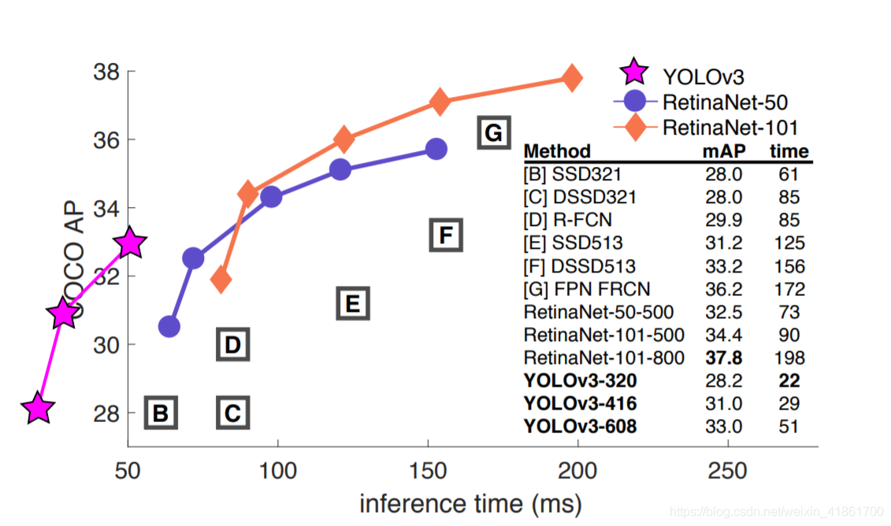

# 基于yolov5的滑块缺口识别

## <div align="center">What is yolo</div>

<div align="center">
<br>
<p>
“You Only Look Once”或“YOLO”是一个对象检测算法的名字，这是Redmon等人在2016年的一篇研究论文中命名的。是当前出色的目标检测算法之一。
(官方Github官方地址: <a href="https://github.com/ultralytics/yolov5">YOLOv5</a>)
</p>
</div>

## <div align="center">Why choice YOLO</div>

YOLO系列的算法是目标识别任务中比较前沿的算法之一。由于其出色的推理速度、较小的模型大小和妈妈般的呵护 **(提供大量的方便的接口)** ，
广受开发者的喜爱。下图是YOLOv3与其他目标检测算法性能的比较，其图来自YOLOv3论文原图。**(作者为了突出其性能将YOLOv3性能曲线标在了坐标系外)**


### 模型使用

demo_test.py提供了一个案例用法，只需要修改很少的东西，就可以完成识别任务.
```python
m = Terminal(weights='weights/GapYolov5s.pt', imgsz=160, conf_thres=0.7, iou_thres=0.45)
boxes = m.forward('data/demo/1001.png')
for box in boxes:
    print(box)
```

<details open>
<summary>必要参数</summary>

- weights: 模型的路径地址
- imgsz: 模型输入的图片尺寸, 一般与训练时设置的尺寸相同就行

</details>

<details>
<summary>选填参数</summary>

- conf_thres: 置信度阈值，小于阈值的丢弃
- iou_thres: 非极大值抑制阈值，用于区分重复的识别框
- max_det: 每张图最大的识别框数目
- device: 指定GPU的序号或CPU, 默认为空
- classes: 指定要哪些标签，例如只要0标签 --class=0; 默认是None，全要
- agnostic_nms: class-agnostic NMS
- augment: 增强模型推理
- half: 使用全精度浮点数还是半精度浮点数
- log: 是否打印logging日志输入

</details>


### 模型训练
1. 准备好数据集, 使用labelimg或labelme工具进行数据集标注，标签文件是yolo格式
2. yolo格式数据(中心点x / 图片宽度, 中心点y / 图片高度, 框的宽度 / 图片宽度, 框的高度 / 图片高度)
3. 分割训练集或验证集，可通过文件夹分割或用txt文件指定训练集验证集的文件路径.
4. 编写data目录下的yaml文件
5. 下载对应使用的yolov5预训练权重文件
6. 修改models目录下对应的预训练文件的yaml
7. 选择好参数, 即可使用python train.py进行训练
8. 观察数据曲线等信息，确认模型的好坏

训练过程可参考<a href="https://blog.csdn.net/weixin_41861700/article/details/118654747">【YOLO使用】YOLOv5训练目标检测任务入门用法（一）</a>